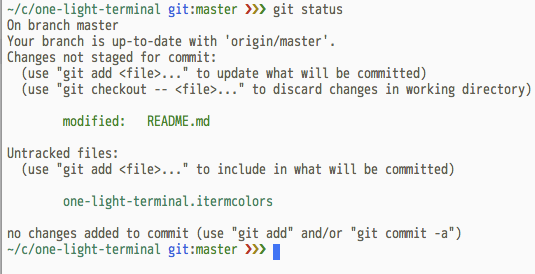

# one-light-terminal

### [Download the iTerm theme from Here](one-light-terminal.itermcolors).

A theme for iTerm that mimics the [One Light Theme](http://github.com/atom/one-light-syntax) made by the Atom team. Inspired by [one-dark-terminal](https://github.com/nathanbuchar/one-dark-terminal).



Currently only supports iTerm2. Pull Requests for Terminal.app welcome.

## Reference Colors from One Light Theme

- Used `.gray` for foreground, bold, and selected text, and black text color.
- Used `.syntax-background-color` for background color, cursor text, and white text color.
- Used `.syntax-selection-color` for selection.
- For all other ANSI colors, used the corresponding color name.

```css
.black {
  color: #050505;
}
.light-black {
  color: #0e0e0c;
}
.very-dark-gray {
  color: #535047;
}
.dark-gray {
  color: #615f51;
}
.gray {
  color: #807c66;
}
.light-gray {
  color: #908b6f;
}
.very-light-gray {
  color: #d7d1ad;
}
.white {
  color: #fbf1bc;
}
.red {
  color: #b72424;
}
.orange {
  color: #87400d;
}
.light-orange {
  color: #a18912;
}
.green {
  color: #4b862c;
}
.cyan {
  color: #178262;
}
.blue {
  color: #3b62d9;
}
.purple {
  color: #a431c4;
}
.dark-red {
  color: #b0263f;
}
.syntax-bracket-matcher-background-color {
  color: #eaeaeb;
}
.syntax-text-color {
  color: #615f51;
}
.syntax-cursor-color {
  color: #3474f4;
}
.syntax-selection-color {
  color: #e5e5e6;
}
.syntax-selection-flash-color {
  color: #3474f4;
}
.syntax-background-color {
  color: #fafafa;
}
.syntax-wrap-guide-color {
  color: rgba(97, 95, 81, 0.4);
}
.syntax-indent-guide-color {
  color: rgba(97, 95, 81, 0.4);
}
.syntax-invisible-character-color {
  color: rgba(97, 95, 81, 0.4);
}
.syntax-cursor-line {
  color: rgba(56, 75, 112, 0.07);
}
.syntax-result-marker-color {
  color: #615f51;
}
.syntax-result-marker-color-selected {
  color: #3474f4;
}
.syntax-gutter-text-color {
  color: #9d9e9f;
}
.syntax-gutter-text-color-selected {
  color: #676a6f;
}
.syntax-gutter-background-color {
  color: transparent;
}
.syntax-gutter-background-color-selected {
  color: #eff0f0;
}
.syntax-color-renamed {
  color: #52aeff;
}
.syntax-color-added {
  color: #2db448;
}
.syntax-color-modified {
  color: #f2a60d;
}
.syntax-color-removed {
  color: #ff1414;
}
```

The above was outputted from this LESS code:

```less
.black { color: @black }
.light-black { color: @light-black }
.very-dark-gray { color: @very-dark-gray }
.dark-gray { color: @dark-gray }
.gray { color: @gray }
.light-gray { color: @light-gray }
.very-light-gray { color: @very-light-gray }
.white { color: @white }
.red { color: @red }
.orange { color: @orange }
.light-orange { color: @light-orange }
.green { color: @green }
.cyan { color: @cyan }
.blue { color: @blue }
.purple { color: @purple }
.dark-red { color: @dark-red }
.syntax-bracket-matcher-background-color { color: @syntax-bracket-matcher-background-color }
.syntax-text-color { color: @syntax-text-color }
.syntax-cursor-color { color: @syntax-cursor-color }
.syntax-selection-color { color: @syntax-selection-color }
.syntax-selection-flash-color { color: @syntax-selection-flash-color }
.syntax-background-color { color: @syntax-background-color }
.syntax-wrap-guide-color { color: @syntax-wrap-guide-color }
.syntax-indent-guide-color { color: @syntax-indent-guide-color }
.syntax-invisible-character-color { color: @syntax-invisible-character-color }
.syntax-cursor-line { color: @syntax-cursor-line }
.syntax-result-marker-color { color: @syntax-result-marker-color }
.syntax-result-marker-color-selected { color: @syntax-result-marker-color-selected }
.syntax-gutter-text-color { color: @syntax-gutter-text-color }
.syntax-gutter-text-color-selected { color: @syntax-gutter-text-color-selected }
.syntax-gutter-background-color { color: @syntax-gutter-background-color }
.syntax-gutter-background-color-selected { color: @syntax-gutter-background-color-selected }
.syntax-color-renamed { color: @syntax-color-renamed }
.syntax-color-added { color: @syntax-color-added }
.syntax-color-modified { color: @syntax-color-modified }
.syntax-color-removed { color: @syntax-color-removed }
```
